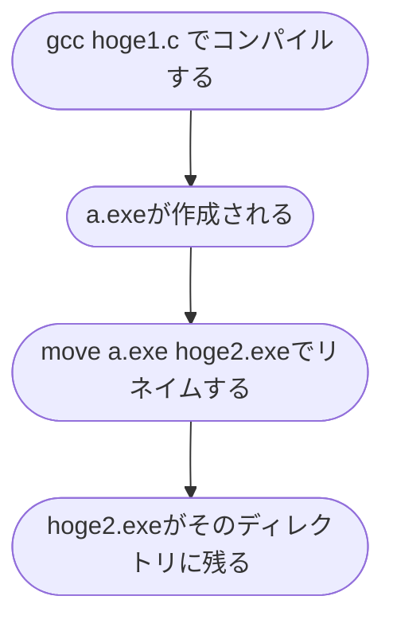

## きっかけ
これは環境にもよるだろうが、私がgccコマンドでCのファイルをコンパイルするとき毎回```a.exe```になってしまう。これでは、何の実行ファイルか分からない.

同じディレクトリ内に複数のc言語のファイルがあると最悪だ.例えば```source1.c```をコンパイルしてから```source2.c```をコンパイルすると```source1.c```の実行ファイルが```source2.c```の実行ファイルに上書きされてしまう。

かといって、毎回renameするのも億劫に思う.

<b>コード全文は最後に</b>

## 本題
<b>コンパイルと同時にa.exeをrenameするコマンドmygccを作ろう</b>
フローチャートは単純だ。

この一連の流れを```mygcc hoge1.c hoge2```というコマンドで一発で終わらせたい.

:::note warn
これから紹介するコードはgccコマンドを使うとa.exeが作成されることが前提です(windows).
Mac,Linuxユーザ用は後程お伝えいたします。
:::

### 因子が3つの場合

```argv[1]```でコンパイルしたいｃのファイルを指定。
```argv[2]```で実行ファイルの名前をを指定。
```c
    if (argc == 3) {
        // Compile the C source file
        char compileCommand[100];
        snprintf(compileCommand, sizeof(compileCommand), "gcc %s", argv[1]);
        system(compileCommand);

        // Rename the compiled output to the desired executable filename
        char moveCommand[100];
        snprintf(moveCommand, sizeof(moveCommand), "move a.exe %s.exe", argv[2]);
        system(moveCommand);

        printf("A file named %s.exe is created\n", argv[2]);
    }

```

私はmoveコマンドをリネイムのために用いたが, 環境によっては```mv```,```ren```, ```rename``` かもしれない(知らんけど)。

   ここでもとのC言語のファイルは拡張子<code>.c</code>まで指定しているのに対して、実行ファイルは<code>.exe</code>まで書か ないのは. . . .<details><summary>詳しく..</summary>
    <p>もとのC言語ファイル名をすべて書かなくても<code>ho*.c</code>のように指定できるようにするためだ。例えば同ディレクトリ内にhoge1.cとhoge1.htmlがあったときなどにエラーが起きる可能性を淘汰するためだ。<code>.c</code> <code>.exe</code>まで書くかは個人の趣味によ るだろうが。
</p>
</details>

### 因子が2つの場合
コンパイルしたいファイルを先に指定してから、実行ファイルの名前を指定する手順のパタンだ.
うっかり```argv[3]```を書きそびれたときに便利。

```c
else if (argc == 2) {
        char exefilename[100];
        puts("Decide filename");
        scanf("%s", exefilename);

        // Compile the C source file
        char compileCommand[100];
        snprintf(compileCommand, sizeof(compileCommand), "gcc %s", argv[1]);
        system(compileCommand);

        // Rename the compiled output to the user-specified executable filename
        char moveCommand[100];
        snprintf(moveCommand, sizeof(moveCommand), "move a.exe %s.exe", exefilename);
        system(moveCommand);

        printf("A file named %s.exe is created\n", exefilename);
    }

```

その他にお決まりのフレーズを盛り込んだコード全文がこちら。

<b>コード全文</b>

```mygcc.c
#include<stdio.h>
#include<stdlib.h>
int main(int argc, char *argv[]){
    if (argc == 3) {
        // Compile the C source file
        char compileCommand[100];
        snprintf(compileCommand, sizeof(compileCommand), "gcc %s", argv[1]);
        system(compileCommand);

        // Rename the compiled output to the desired executable filename
        char moveCommand[100];
        snprintf(moveCommand, sizeof(moveCommand), "move a.exe %s.exe", argv[2]);
        system(moveCommand);

        printf("A file named %s.exe is created\n", argv[2]);
    }
    else if (argc == 2) {
        char exefilename[100];
        puts("Decide filename");
        scanf("%s", exefilename);

        // Compile the C source file
        char compileCommand[100];
        snprintf(compileCommand, sizeof(compileCommand), "gcc %s", argv[1]);
        system(compileCommand);

        // Rename the compiled output to the user-specified executable filename
        char moveCommand[100];
        snprintf(moveCommand, sizeof(moveCommand), "move a.exe %s.exe", exefilename);
        system(moveCommand);

        printf("A file named %s.exe is created\n", exefilename);
    }
    else {
        puts("Usage: mygccc target.c exefilename");
    }

    return 0;
}

```

ただのbatファイルでもできそうな処理だが、c言語コンパイラの問題をｃ言語で解決したいという意地のもと、c言語で解決した。

### 課題

コンパイルしたいファイルの名前を打ち損じたときにコンパイラがエラーを教えてくれるのに"A file named hoge.exe is created"  と嘘をついてくる。"コンパイルに失敗しました.ファイル名を確認してください" くらい気の利いたことが言えるようにしたい.