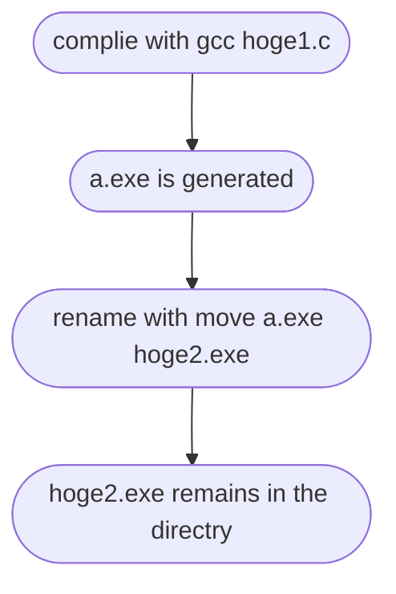

## Why I made this
I guess it depends on your environment tho, everytime I compile a c file with gcc, an execute file named ```a.exe``` is generated. This annoys me a lot. The name doesn't tell me what the execute file is for.
(If you use command option flag "```-o```", this problem would be solved tho)

When multiple c files are in a directry, it makes it even worse. For example, if you compile ```source1.c``` first and then compile ```source2.c```, the executable file of ```source1.c``` will be overwritten by the executable file of ```source2.c```.

but I don't wanna rename the file everytime I compile...

<b>the entire code is at the end</b>


## Main part
<b>create a command "mygcc" to compile a c file and rename a.exe simultaneously </b>
The flowchart of this process is simple like below


I want make a command line ```mygcc hoge1.c hoge2``` to execute the entire process at once.

:::note warn
The code I'm introducing you assumes that a.exe is generated when you use the gcc command(for Windows users).
For Mac or Linux users, a.out would be genrated.
:::

### when the argument count is 3

Specify which c file to compile using ```argv[1]```
Specify a name of an excecutable file with ```argv[2]```
```c
    if (argc == 3) {
        // Compile the C source file
        char compileCommand[100];
        snprintf(compileCommand, sizeof(compileCommand), "gcc %s", argv[1]);
        system(compileCommand);

        // Rename the compiled output to the desired executable filename
        char moveCommand[100];
        snprintf(moveCommand, sizeof(moveCommand), "move a.exe %s.exe", argv[2]);
        system(moveCommand);

        printf("A file named %s.exe is created\n", argv[2]);
    }

```

I used the ```move``` command to rename the file tho you might need to use ```mv```,```ren``` or ```rename``` depending on your environment, I guess. 

<details><summary>In this code, the original C file is specified with the extension <code>.c</code>, while </summary> the executable file is specified only up to <code>.exe</code>. This is to specify multiple C files using wildcards like <code>ho*.c</code>, and to avoid potential errors when there are files with similar names but different extensions in the same directory, such as "hoge1.c" and "hoge1.html"</details>


### when the argument count is 2
Specify which C file to compile first, then name the executable file. 
It is is for when you accidentally missed ```argv[3]``` when running the command.
```c
else if (argc == 2) {
        char exefilename[100];
        puts("Decide filename");
        scanf("%s", exefilename);

        // Compile the C source file
        char compileCommand[100];
        snprintf(compileCommand, sizeof(compileCommand), "gcc %s", argv[1]);
        system(compileCommand);

        // Rename the compiled output to the user-specified executable filename
        char moveCommand[100];
        snprintf(moveCommand, sizeof(moveCommand), "move a.exe %s.exe", exefilename);
        system(moveCommand);

        printf("A file named %s.exe is created\n", exefilename);
    }

```
The entire code, including standard phrases, is as follows:
<b>The entire code</b>

```mygcc.c
#include<stdio.h>
#include<stdlib.h>
int main(int argc, char *argv[]){
    if (argc == 3) {
        // Compile the C source file
        char compileCommand[100];
        snprintf(compileCommand, sizeof(compileCommand), "gcc %s", argv[1]);
        system(compileCommand);

        // Rename the compiled output to the desired executable filename
        char moveCommand[100];
        snprintf(moveCommand, sizeof(moveCommand), "move a.exe %s.exe", argv[2]);
        system(moveCommand);

        printf("A file named %s.exe is created\n", argv[2]);
    }
    else if (argc == 2) {
        char exefilename[100];
        puts("Decide filename");
        scanf("%s", exefilename);

        // Compile the C source file
        char compileCommand[100];
        snprintf(compileCommand, sizeof(compileCommand), "gcc %s", argv[1]);
        system(compileCommand);

        // Rename the compiled output to the user-specified executable filename
        char moveCommand[100];
        snprintf(moveCommand, sizeof(moveCommand), "move a.exe %s.exe", exefilename);
        system(moveCommand);

        printf("A file named %s.exe is created\n", exefilename);
    }
    else {
        puts("Usage: mygccc target.c exefilename");
    }

    return 0;
}

```

Even though the process could be done with a simple batch file, I dared to solve with C, cus it is about C compiler. First of all, all I need to do is use ```gcc -o hoge2.exe hoge1.c``` tho

### Issue

To provide a more helpful error message, instead of falsely stating "A file named hoge.exe is created" when the user mistypes the filename and the compiler failed to compile, it would be more thoughtful to say something like "Compilation failed. Please check the filename."
